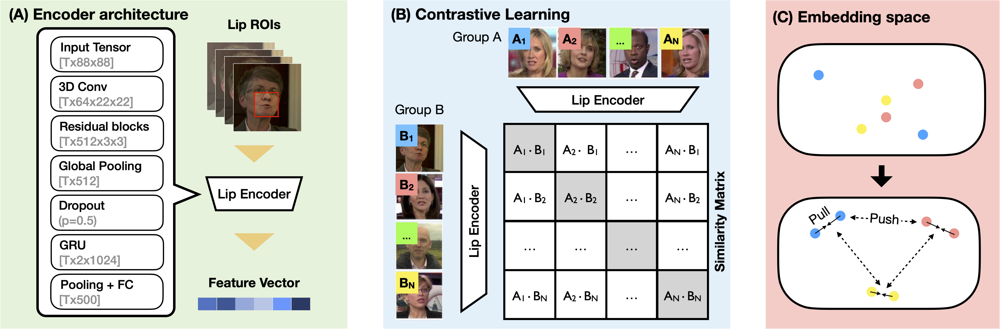

# LipLearner: Customizable Silent Speech Interactions on Mobile Devices

This is the repository for **LipLearner: Customizable Silent Speech Interactions on Mobile Devices** (CHI 2023). It contains PyTorch scripts for contrastive pre-training and the source code of the iOS application. Please refer to our paper for more details. 
[arXiv preprint](https://arxiv.org/abs/2302.05907) 
[ACM Digital Library](https://doi.org/10.1145/3544548.3581465)

# Content
- [LipLearner: Customizable Silent Speech Interactions on Mobile Devices](#liplearner-customizable-silent-speech-interactions-on-mobile-devices)
- [Content](#content)
- [Learn Visual Speech Representations with Contrastive Learning](#learn-visual-speech-representations-with-contrastive-learning)
    - [Dependencies](#dependencies)
    - [Dataset Preparation](#dataset-preparation)
    - [Pretrain Weights](#pretrain-weights)
    - [How to train](#how-to-train)
- [On-device Silent Speech Recognizer with In-situ command customization](#on-device-silent-speech-recognizer-with-in-situ-command-customization)
- [Citation](#citation)
- [License](#license)

# Learn Visual Speech Representations with Contrastive Learning

The `prtraining` folder contains the contrastive pretraining scripts based on Feng et al.'s 3D convolutional neural networks. We use the public lipreading dataset [LRW](http://www.robots.ox.ac.uk/~vgg/data/lip_reading/lrw1.html) to learn efficient visual speech representations, which serve as the cornerstone our few-shot learning silent speech command customization framework.


### Dependencies

- PyTorch 1.12
- Torchvision
- OpenCV-Python
- SciPy
- TurboJPEG and [PyTurboJPEG](https://github.com/lilohuang/PyTurboJPEG)

### Dataset Preparation

0. Install dependencies

```
cd pretraining
pip install -r requirements.txt
```

1. Download [LRW Dataset](http://www.robots.ox.ac.uk/~vgg/data/lip_reading/lrw1.htm) and link `lrw_mp4` in the root of this repository:

```
ln -s PATH_TO_DATA/lrw_mp4 .
```

2. Run `scripts/prepare_lrw.py` to generate training samples of LRW respectively:

```
python scripts/prepare_lrw.py
```
Processed data will be saved in the `lrw_roi_63_99_191_227_size128_npy_gray_pkl_jpeg` directory, as the lip images are cropped with a 128x128 ROI.

### Pretrain Weights

We provide pretrained weights [here (Google Drive)](https://drive.google.com/file/d/1RK7no1QH8QFZzjVrmg64X8wuCLRfJzu3/view?usp=share_link).

### How to train
```
bash train.sh
```

More training details and settings can be found in [our paper](https://arxiv.org/abs/xxx.xxx).

# On-device Silent Speech Recognizer with In-situ command customization


We developed an iOS application that allows people to experience silent speech interaction on commodity smartphones. This application provides totally real-time and on-device lipreading, a visual keyword spotting system for hands-free activation, and an online incremental learning scheme that learns continously during use. The following diagram explains how it works:


*User experience and interface design. (A) The interface of the initialization phase. The user first needs to record keyword and non-speaking samples to enable KWS activation. (B) The user says a command aloud for command registration. The voice signal will be leveraged to label the silent speech, allowing fast command registration (Voice2Lip). (C) The interface for querying the right label in the active learning mode. Users can slide through the existing commands sorted by similarity to select and add a new sample to the model. Users can update the model at any time by using the button at the upper-right corner, which usually takes around 2 seconds on iPhone. (D) An example showing the command "play some music" is recognized correctly and executed successfully by the pre-set shortcut. (E) The interface for correcting the predictions in on-demand learning mode. The user can review recent utterances displayed as a GIF animation*

To get started, download the Xcode project from the `LipLearner` folder. The Core ML format lipreading encoder model has been compressed into a .tar.gz file to avoid exceeding the file size limit on Github. So you will need to extract the weights on your computer before building the iOS App.

```
cd LipLearner_iOS/LipEncoder.mlpackage/Data/com.apple.CoreML/weights
tar -xzvf weight.bin.tar.gz
```

Please note that our testing has shown that the app works best on iPhone 11 or newer models. If you experience overheating or frequent crashes, we recommend turning off the camera view from the settings menu as video rendering can be taxing on the CPU. For older iPhone models, the inference may take longer time than the slide window length of our visual KWS function. In such cases, it's best to turn off the KWS function and use the recording button (long-press) to start recognition.

To avoid overheating, we added a silent speech activity detection (SSAD) function that works like the voice activity detection (VAD) function in speech recognition systems. It detects the keyword only when the user’s mouth is open. Note that this trick was not used in the user study in our paper.

In the free use mode, you can use your silent speech command to activate different functions. You need to create your own shortcuts, such as “play some music”, and register a silent speech command that matches the shortcut’s name exactly


We will provide a tutorial video to help you get started in the furture.

# Citation

If you find this codebase useful for your research, please consider to cite our CHI 2023 paper and Feng's papers:

```
@article{su2023liplearner,
  title={LipLearner: Customizable Silent Speech Interactions on Mobile Devices},
  author={Su, Zixiong and Fang, Shitao and Rekimoto, Jun},
  journal={arXiv preprint arXiv:2302.05907},
  year={2023}
}

@inproceedings{feng2021efficient,
  title={An Efficient Software for Building LIP Reading Models Without Pains},
  author={Feng, Dalu and Yang, Shuang and Shan, Shiguang},
  booktitle={2021 IEEE International Conference on Multimedia \& Expo Workshops (ICMEW)},
  pages={1--2},
  year={2021},
  organization={IEEE}
}

@article{feng2020learn,
  author       = "Feng, Dalu and Yang, Shuang and Shan, Shiguang and Chen, Xilin",
  title        = "Learn an Effective Lip Reading Model without Pains",
  journal      = "arXiv preprint arXiv:2011.07557",
  year         = "2020",
}
```

# License

The MIT License
